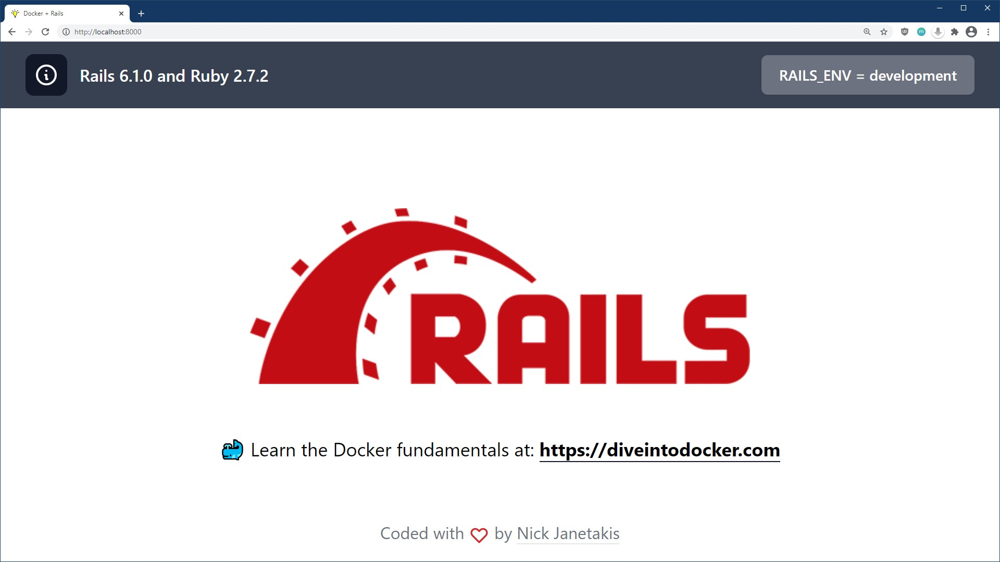

# 🐳 An example Rails + Docker app

You could use this example app as a base for your new project or as a guide to
Dockerize your existing Rails app.

The example app is minimal but it wires up a number of things you might use in
a real world Rails app, but at the same time it's not loaded up with a million
personal opinions.

For the Docker bits, everything included is an accumulation of [Docker best
practices](https://nickjanetakis.com/blog/best-practices-around-production-ready-web-apps-with-docker-compose)
based on building and deploying dozens of assorted Dockerized web apps since
late 2014.

**This app is using Rails 8.1.1 and Ruby 4.0.0**. The screenshot shows
`X.X.X` since they get updated regularly:

[](https://github.com/nickjj/docker-rails-example/blob/main/.github/docs/screenshot.jpg?raw=true)

## 🧾 Table of contents

- [Tech stack](#tech-stack)
- [Main changes vs a newly generated Rails app](#main-changes-vs-a-newly-generated-rails-app)
- [Running this app](#running-this-app)
- [Files of interest](#files-of-interest)
  - [`.env`](#env)
  - [`run`](#run)
- [Running a script to automate renaming the project](#running-a-script-to-automate-renaming-the-project)
- [Updating dependencies](#updating-dependencies)
- [See a way to improve something?](#see-a-way-to-improve-something)
- [Additional resources](#additional-resources)
  - [Learn more about Docker and Ruby on Rails](#learn-more-about-docker-and-ruby-on-rails)
  - [Deploy to production](#deploy-to-production)
- [About the author](#about-the-author)

## 🧬 Tech stack

If you don't like some of these choices that's no problem, you can swap them
out for something else on your own.

### Back-end

- [PostgreSQL](https://www.postgresql.org/)
- [Redis](https://redis.io/)
- [Sidekiq](https://github.com/mperham/sidekiq)
- [Action Cable](https://guides.rubyonrails.org/action_cable_overview.html)
- [ERB](https://guides.rubyonrails.org/layouts_and_rendering.html)

### Front-end

- [esbuild](https://esbuild.github.io/)
- [Hotwire Turbo](https://hotwired.dev/)
- [StimulusJS](https://stimulus.hotwired.dev/)
- [TailwindCSS](https://tailwindcss.com/)
- [Heroicons](https://heroicons.com/)

## 🍣 Notable opinions and packages

Here's a run down on what's different. You can also use this as a guide to
Dockerize an existing Rails app.

- **Core**:
    - Use PostgreSQL (`-d postgresql)` as the primary SQL database
    - Use Redis as the cache back-end
    - Use Sidekiq as a background worker through Active Job
    - Use a standalone Action Cable process
    - Remove `solid_*` adapters (for now)
    - Remove Kamal and Thruster (for now)
- **App Features**:
    - Add `pages` controller with a home page
    - Add `up` controller with 2 health check related actions
    - Remove generated code around PWA and service workers
- **Config**:
    - Log to STDOUT so that Docker can consume and deal with log output
    - Credentials are removed (secrets are loaded in with an `.env` file)
    - Extract a bunch of configuration settings into environment variables
    - Rewrite `config/database.yml` to use environment variables
    - `.yarnc` sets a custom `node_modules/` directory
    - `config/initializers/enable_yjit.rb` to enable YJIT
    - `config/initializers/rack_mini_profiler.rb` to enable profiling Hotwire Turbo Drive
    - `config/routes.rb` has Sidekiq's dashboard ready to be used but commented out for safety
    - `Procfile.dev` has been removed since Docker Compose handles this for us
    - Brakeman has been removed
- **Assets**:
    - Use esbuild (`-j esbuild`) and TailwindCSS (`-c tailwind`)
    - Add `postcss-import` support for `tailwindcss` by using the `--postcss` flag
    - Add ActiveStorage JavaScript package
    - Add [Hotwire Spark](https://github.com/hotwired/spark) for live reloading in development
- **Public:**
    - Custom `502.html` and `maintenance.html` pages
    - Generate favicons using modern best practices

Besides the Rails app itself, a number of new Docker related files were added
to the project which would be any file having `*docker*` in its name. Also
GitHub Actions have been set up.

## 🚀 Running this app

You'll need to have [Docker installed](https://docs.docker.com/get-docker/).
It's available on Windows, macOS and most distros of Linux. If you're new to
Docker and want to learn it in detail check out the [additional resources
links](#learn-more-about-docker-and-ruby-on-rails) near the bottom of this
README.

You'll also need to enable Docker Compose v2 support if you're using Docker
Desktop. On native Linux without Docker Desktop you can [install it as a plugin
to Docker](https://docs.docker.com/compose/install/linux/). It's been generally
available for a while now and is stable. This project uses specific [Docker
Compose v2
features](https://nickjanetakis.com/blog/optional-depends-on-with-docker-compose-v2-20-2)
that only work with Docker Compose v2 2.20.2+.

If you're using Windows, it will be expected that you're following along inside
of [WSL or WSL
2](https://nickjanetakis.com/blog/a-linux-dev-environment-on-windows-with-wsl-2-docker-desktop-and-more).
That's because we're going to be running shell commands. You can always modify
these commands for PowerShell if you want.

#### Clone this repo anywhere you want and move into the directory:

```sh
git clone https://github.com/nickjj/docker-rails-example hellorails
cd hellorails

# Optionally checkout a specific tag, such as: git checkout 0.9.0
```

#### Copy an example .env file because the real one is git ignored:

```sh
cp .env.example .env
```

#### Build everything:

*The first time you run this it's going to take 5-10 minutes depending on your
internet connection speed and computer's hardware specs. That's because it's
going to download a few Docker images and build the Ruby + Yarn dependencies.*

```sh
docker compose up --build
```

Now that everything is built and running we can treat it like any other Rails
app.

Did you receive a `depends_on` "Additional property required is not allowed"
error? Please update to at least Docker Compose v2.20.2+ or Docker Desktop
4.22.0+.

Did you receive an error about a port being in use? Chances are it's because
something on your machine is already running on port 8000. Check out the docs
in the `.env` file for the `DOCKER_WEB_PORT` variable to fix this.

Did you receive a permission denied error? Chances are you're running native
Linux and your `uid:gid` aren't `1000:1000` (you can verify this by running
`id`). Check out the docs in the `.env` file to customize the `UID` and `GID`
variables to fix this.

#### Setup the initial database:

```sh
# You can run this from a 2nd terminal.
./run rails db:setup
```

*We'll go over that `./run` script in a bit!*

#### Check it out in a browser:

Visit <http://localhost:8000> in your favorite browser.

#### Formatting the code base:

```sh
# You should see that everything is unchanged (it's all already formatted).
./run format
```

You can also run `./run format --auto-correct` which will automatically correct
any issues that are auto-correctable. Alternatively the shorthand `-a` flag
does the same thing.

*There's also a `./run quality` command to lint and format all files.*

#### Running the test suite:

```sh
# You can run this from the same terminal as before.
./run test
```

You can also run `./run test -b` with does the same thing but builds your JS
and CSS bundles. This could come in handy in fresh environments such as CI
where your assets haven't changed and you haven't visited the page in a
browser.

#### Stopping everything:

```sh
# Stop the containers and remove a few Docker related resources associated to this project.
docker compose down
```

You can start things up again with `docker compose up` and unlike the first
time it should only take seconds.

## 🔍 Files of interest

I recommend checking out most files and searching the code base for `TODO:`,
but please review the `.env` and `run` files before diving into the rest of the
code and customizing it. Also, you should hold off on changing anything until
we cover how to customize this example app's name with an automated script
(coming up next in the docs).

### `.env`

This file is ignored from version control so it will never be commit. There's a
number of environment variables defined here that control certain options and
behavior of the application. Everything is documented there.

Feel free to add new variables as needed. This is where you should put all of
your secrets as well as configuration that might change depending on your
environment (specific dev boxes, CI, production, etc.).

### `run`

You can run `./run` to get a list of commands and each command has
documentation in the `run` file itself.

It's a shell script that has a number of functions defined to help you interact
with this project. It's basically a `Makefile` except with [less
limitations](https://nickjanetakis.com/blog/replacing-make-with-a-shell-script-for-running-your-projects-tasks).
For example as a shell script it allows us to pass any arguments to another
program.

This comes in handy to run various Docker commands because sometimes these
commands can be a bit long to type. Feel free to add as many convenience
functions as you want. This file's purpose is to make your experience better!

*If you get tired of typing `./run` you can always create a shell alias with
`alias run=./run` in your `~/.bash_aliases` or equivalent file. Then you'll be
able to run `run` instead of `./run`.*

## ✨ Running a script to automate renaming the project

The app is named `hello` right now but chances are your app will be a different
name. Since the app is already created we'll need to do a find / replace on a
few variants of the string "hello" and update a few Docker related resources.

And by we I mean I created a zero dependency shell script that does all of the
heavy lifting for you. All you have to do is run the script below.

#### Run the rename-project script included in this repo:

```sh
# The script takes 2 arguments.
#
# The first one is the lower case version of your app's name, such as myapp or
# my_app depending on your preference.
#
# The second one is used for your app's module name. For example if you used
# myapp or my_app for the first argument you would want to use MyApp here.
bin/rename-project myapp MyApp
```

The [bin/rename-project
script](https://github.com/nickjj/docker-rails-example/blob/main/bin/rename-project)
is going to:

- Remove any Docker resources for your current project
- Perform a number of find / replace actions
- Optionally initialize a new git repo for you

*Afterwards you can delete this script because its only purpose is to assist in
helping you change this project's name without depending on any complicated
project generator tools or 3rd party dependencies.*

If you're not comfy running the script or it doesn't work for whatever reasons
you can [check it
out](https://github.com/nickjj/docker-rails-example/blob/main/bin/rename-project)
and perform the actions manually. It's mostly running a find / replace across
files and then renaming a few directories and files.

#### Start and setup the project:

This won't take as long as before because Docker can re-use most things. We'll
also need to setup our database since a new one will be created for us by
Docker.

```sh
docker compose up --build

# Then in a 2nd terminal once it's up and ready.
./run rails db:setup
```

#### Sanity check to make sure the tests still pass:

It's always a good idea to make sure things are in a working state before
adding custom changes.

```sh
# You can run this from the same terminal as before.
./run quality
./run test
```

If everything passes now you can optionally `git add -A && git commit -m
"Initial commit"` and start customizing your app. Alternatively you can wait
until you develop more of your app before committing anything. It's up to you!

#### Tying up a few loose ends:

You'll probably want to create a fresh `CHANGELOG.md` file for your project. I
like following the style guide at <https://keepachangelog.com/> but feel free
to use whichever style you prefer.

Since this project is MIT licensed you should keep my name and email address in
the `LICENSE` file to adhere to that license's agreement, but you can also add
your name and email on a new line.

If you happen to base your app off this example app or write about any of the
code in this project it would be rad if you could credit this repo by linking
to it. If you want to reference me directly please link to my site at
<https://nickjanetakis.com>. You don't have to do this, but it would be very
much appreciated!

## 🛠 Updating dependencies

You can run `./run bundle:outdated` or `./run yarn:outdated` to get a list of
outdated dependencies based on what you currently have installed. Once you've
figured out what you want to update, go make those updates in your `Gemfile`
and / or `package.json` file.

Or, let's say you've customized your app and it's time to add a new dependency,
either for Ruby or Node.

#### In development:

##### Option 1

1. Directly edit `Gemfile` or `package.json` to add your package
2. `./run deps:install` or `./run deps:install --no-build`
    - The `--no-build` option will only write out a new lock file without re-building your image

##### Option 2

1. Run `./run bundle add mypackage --skip-install` or `run yarn add mypackage --no-lockfile` which will update your `Gemfile` or `package.json` with the latest version of that package but not install it
2. The same step as step 2 from option 1

Either option is fine, it's up to you based on what's more convenient at the
time. You can modify the above workflows for updating an existing package or
removing one as well.

You can also access `bundle` and `yarn` in Docker with `./run bundle` and
`./run yarn` after you've upped the project.

#### In CI:

You'll want to run `docker compose build` since it will use any existing lock
files if they exist. You can also check out the complete CI test pipeline in
the [run](https://github.com/nickjj/docker-rails-example/blob/main/run) file
under the `ci:test` function.

#### In production:

This is usually a non-issue since you'll be pulling down pre-built images from
a Docker registry but if you decide to build your Docker images directly on
your server you could run `docker compose build` as part of your deploy
pipeline which is similar to how it would work in CI.

## 🤝 See a way to improve something?

If you see anything that could be improved please open an issue or start a PR.
Any help is much appreciated!

## 🌎 Additional resources

Now that you have your app ready to go, it's time to build something cool! If
you want to learn more about Docker, Rails and deploying a Rails app here's a
couple of free and paid resources. There's Google too!

### Learn more about Docker and Ruby on Rails

#### Official documentation

- <https://docs.docker.com/>
- <https://guides.rubyonrails.org/>

#### Courses / Screencasts

- [https://diveintodocker.com](https://diveintodocker.com?ref=docker-rails-example)
  is a course I created which goes over the Docker and Docker Compose
  fundamentals

### Deploy to production

I'm creating an in-depth course related to deploying Dockerized web apps. If
you want to get notified when it launches with a discount and potentially get
free videos while the course is being developed then [sign up here to get
notified](https://nickjanetakis.com/courses/deploy-to-production).

## 👀 About the author

- Nick Janetakis | <https://nickjanetakis.com> | [@nickjanetakis](https://twitter.com/nickjanetakis)

I'm a self taught developer and have been freelancing for the last ~20 years.
You can read about everything I've learned along the way on my site at
[https://nickjanetakis.com](https://nickjanetakis.com/).

There's hundreds of [blog posts](https://nickjanetakis.com/blog) and a couple
of [video courses](https://nickjanetakis.com/courses) on web development and
deployment topics. I also have a [podcast](https://runninginproduction.com)
where I talk with folks about running web apps in production.
